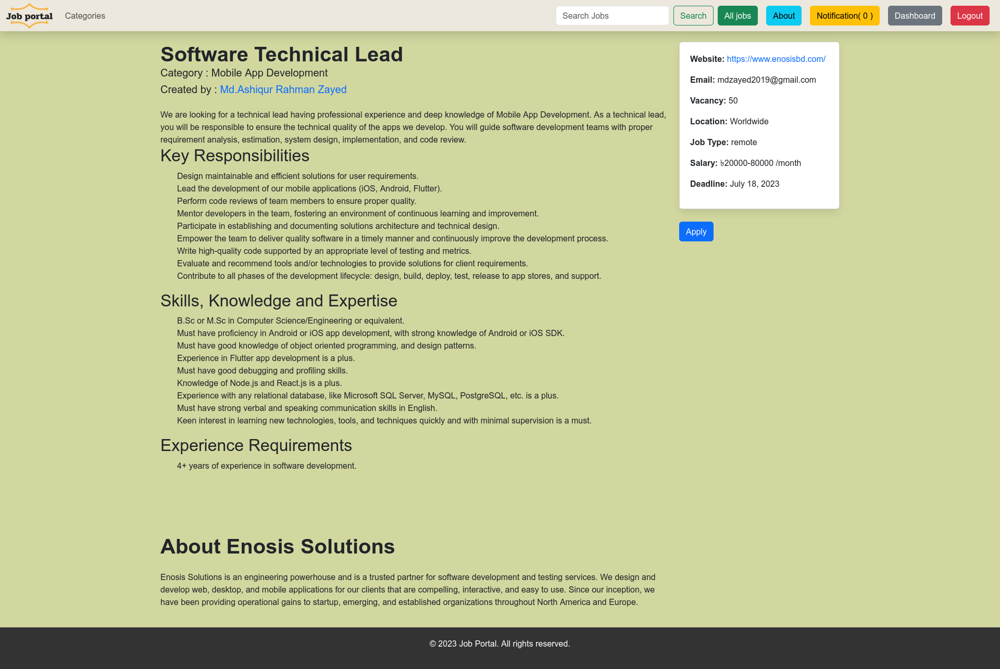
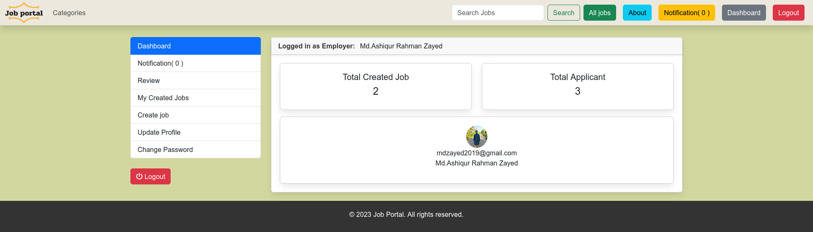
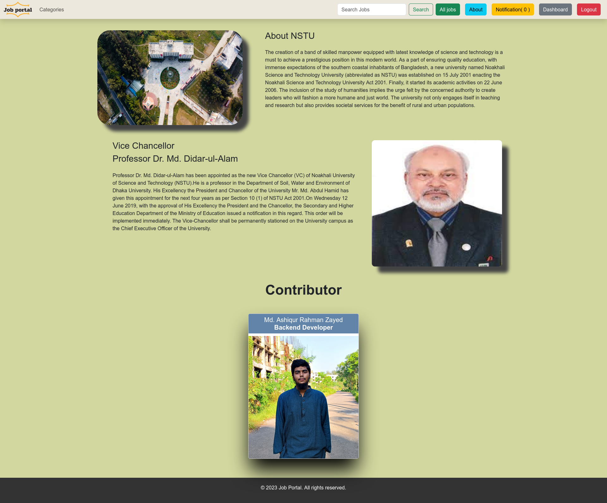
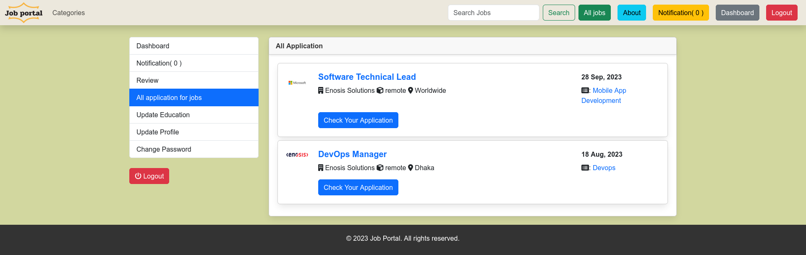
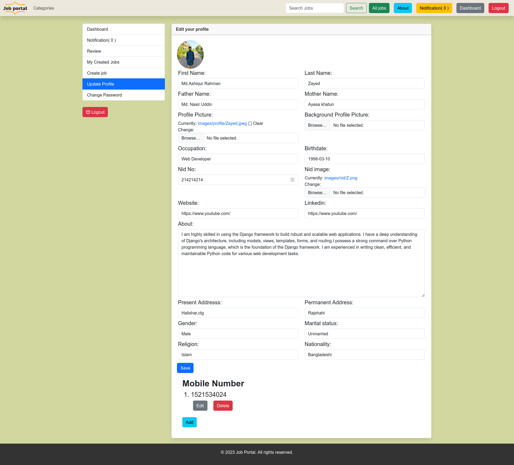
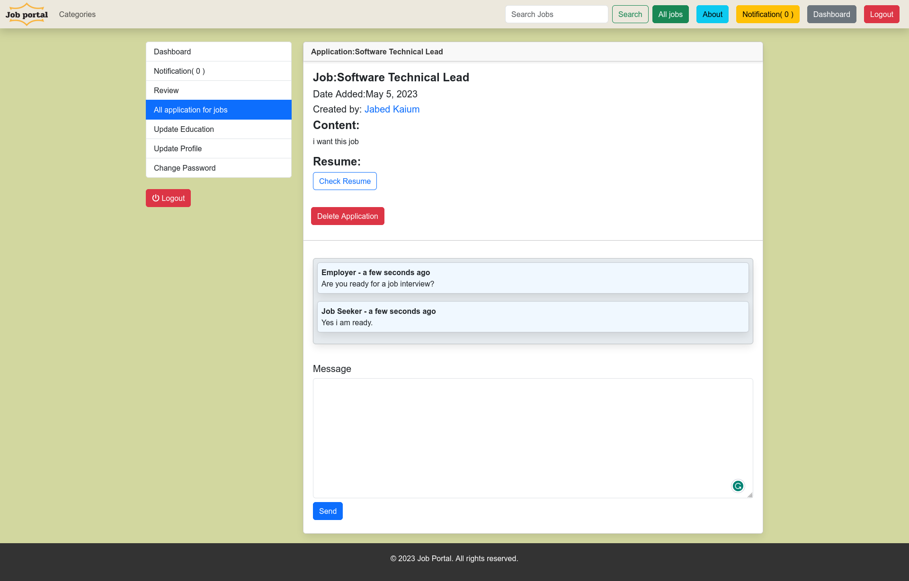
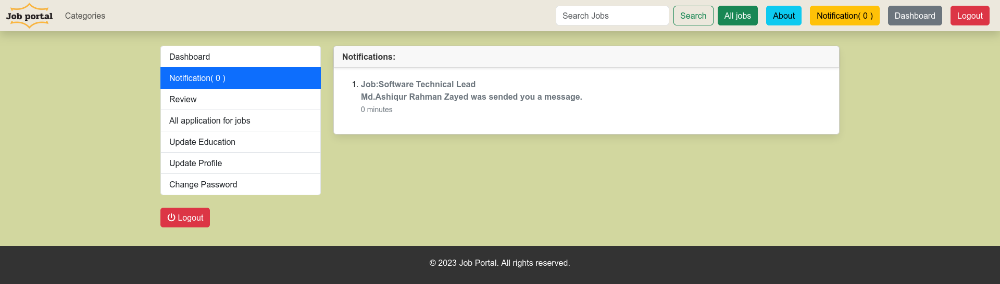

# Job-Portal
<b>Live: http://mdzayed.pythonanywhere.com/ </b><br>
An online job portal is to provide a platform where job seekers can search for job openings, and where employers can post job vacancies and find qualified candidates. The goal is to create a centralized and efficient system that simplifies the job search and hiring process for both job seekers and employers. The project should offer features such as job search filters, user profiles, job application tracking, and job posting management. Overall, the aim is to create a user-friendly, accessible, and reliable job portal that helps to bridge the gap between job seekers and employers.
<br>
<b>NB:</b><br>
1. Sign-up needs Gmail verification. So You have to create an info.py in the jobPortal folder and fill it just like info-demo.py.After signing in you need to complete your profile to create Jobs and apply for jobs.<br>

## Setup
The first thing is cloning the repository:
```sh
$ git clone https://github.com/MdAshiqurRahmanZayed/Job-Portal.git
$ cd Job-Portal
```
Install [uv](https://docs.astral.sh/uv/getting-started/installation/), then sync dependencies (creates a virtual environment automatically):
```sh
$ uv sync
```
Create info.py in the jobPortal folder just like info-demo.py and fill in the equivalent answer(email,password).<br>
We have to migrate.
```sh
$ uv run python manage.py makemigrations
$ uv run python manage.py migrate
$ uv run python manage.py createsuperuser
```

```sh
$ uv run python manage.py runserver
```
Navigate to `http://127.0.0.1:8000/`<br>

## Docker Setup

Create your `.env` file:
```bash
cp .env.example .env
```

**Important:** The `.env` file is already configured for Docker. The key settings are:
- `DB_HOST=host.docker.internal`


### Step 2: Build Docker Images

```bash
docker build .
```

### Step 3: Start Services

```bash
docker-compose -f docker-compose.yml up --build
```
Navigate to `http://127.0.0.1:9000/`<br>

## Running Tests

Locally, using `uv`:
```sh
$ uv run python manage.py test
```

Inside the Docker container (with `docker compose up` already running):
```sh
$ docker compose exec web python manage.py test
```

## PythonAnywhere Deployment

The live deployment on PythonAnywhere no longer uses `pip`/`requirements.txt`.
In the PythonAnywhere console, one-time setup:
```sh
$ curl -LsSf https://astral.sh/uv/install.sh | sh
$ cd Job-Portal
$ uv sync
```
Each subsequent deploy, instead of `pip install -r requirements.txt`, run:
```sh
$ uv sync
```
Run management commands the same way, e.g. `uv run python manage.py migrate`.

Demo Screenshots:








