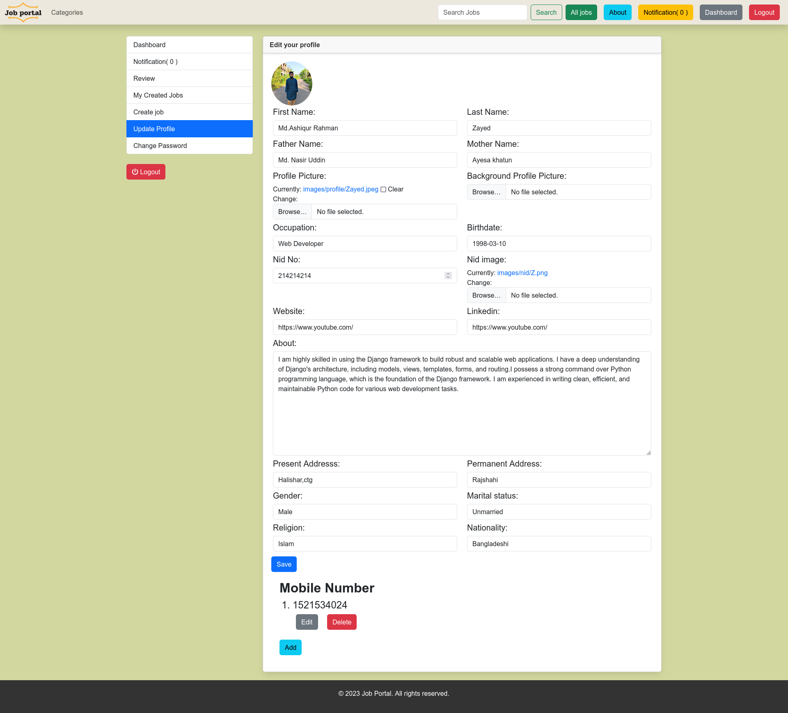

# Job-Portal
<b>Live: http://mdzayed.pythonanywhere.com/ </b><br>
An online job portal is to provide a platform where job seekers can search for job openings, and where employers can post job vacancies and find qualified candidates. The goal is to create a centralized and efficient system that simplifies the job search and hiring process for both job seekers and employers. The project should offer features such as job search filters, user profiles, job application tracking, and job posting management. Overall, the aim is to create a user-friendly, accessible, and reliable job portal that helps to bridge the gap between job seekers and employers.
<br>
<b>NB:</b><br>
1. Sign-up needs Gmail verification. So You have to create an info.py in the jobPortal folder and fill it just like info-demo.py.After signing in you need to complete your profile to create Jobs and apply for jobs.<br>

## Setup
The first thing is cloning the repository:
```sh
$ git clone https://github.com/MdAshiqurRahmanZayed/Job-Portal.git
$ cd Job-Portal
```
Create a virtual environment to install dependencies in and activate it:
```sh
$ python -m venv env
$ source env/bin/activate
```
Then install the dependencies:
```sh
(env)$ pip install -r requirements.txt
```
Create info.py in the jobPortal folder just like info-demo.py and fill in the equivalent answer(email,password).<br>
We have to migrate.
```sh
$ python manage.py makemigrations
$ python manage.py migrate
$ python manage.py createsuperuser
```

```sh
(env)$ python manage.py runserver
```
And navigate to `http://127.0.0.1:8000/`<br>
Demo Screenshots:





